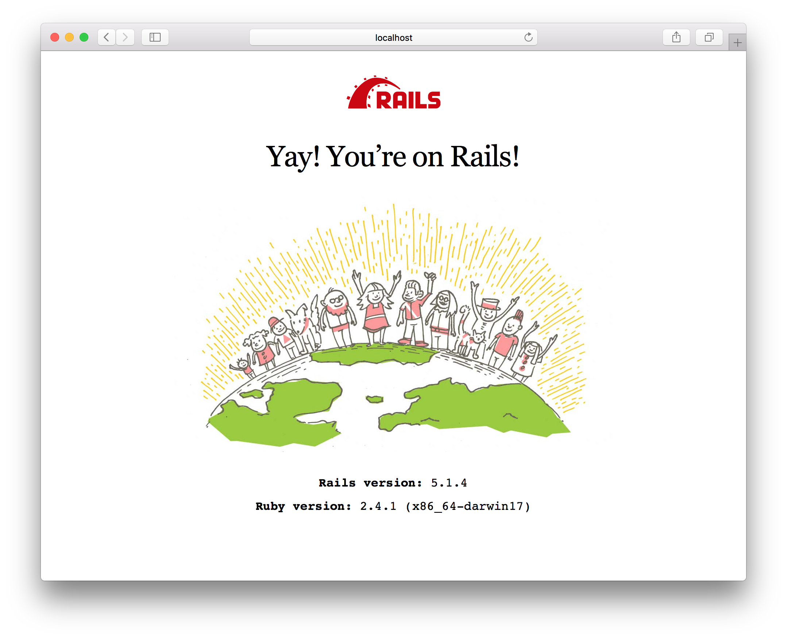
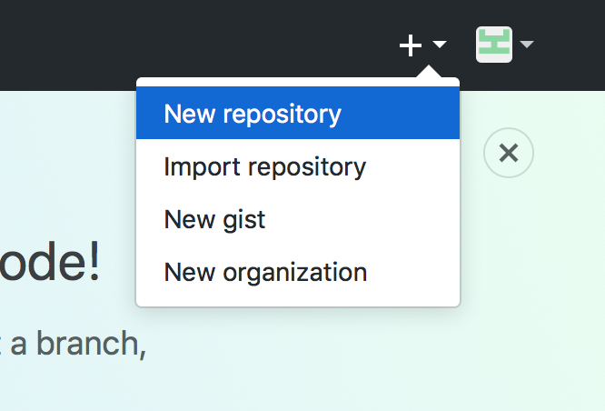
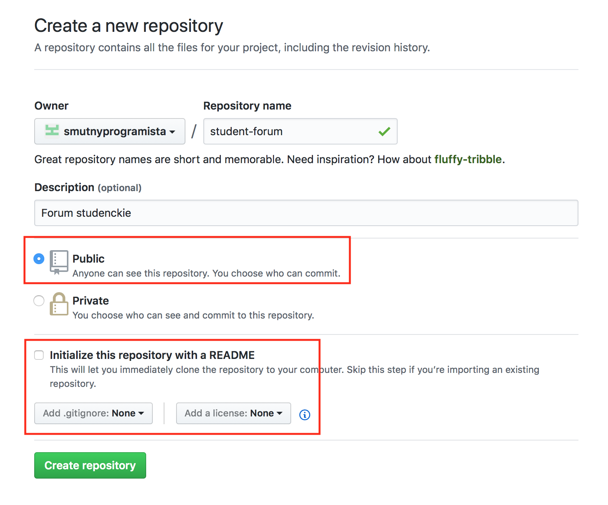
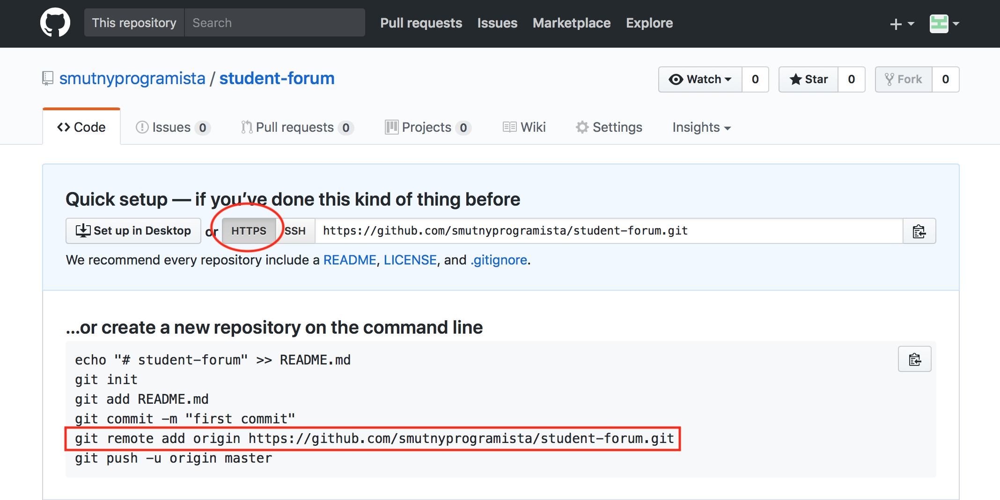
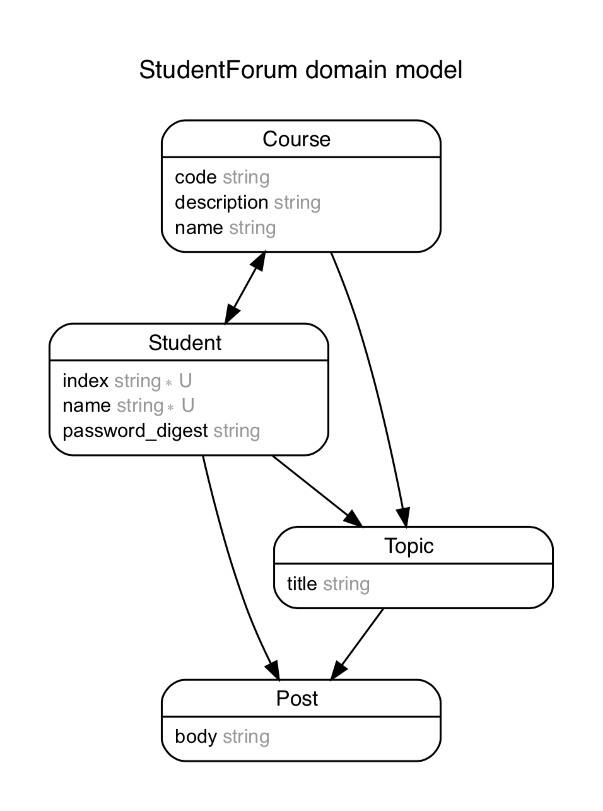

# Aplikacje Mobilne — Laboratorium pierwsze
W dzisiejszym, wstępnym raczej, laboratorium, zmierzą się Państwo z tutorialem, którego pozytywne zakończenie poskutkuje stworzeniem prostego serwisu internetowego. Będzie to uproszczone, studenckie forum, w którym po rejestracji i zalogowaniu, studenci będą mogli zapisywać się do kursów, którymi są zainteresowani, w kursach zakładać tematy, a do tematów tworzyć odpowiedzi.

W instrukcji stosowane będą poniższe konwencje:

> **Ważne!** — Dodatkowe zadania do zrealizowania będą pojawiać się w tekście zaznaczonym w taki sposób jak ten. Zadanie oddajemy przez zgłoszenie na koniec zajęć adresu do repozytorium zawierającego zapisany i wypchnięty (`git add .; git commit -m 'Moje wspaniałe rozwiązanie'; git push`) kod aplikacji.

- `komendy do wpisania w terminalu wyglądać będą jak to zdanie`

`plik_z_kodem.rb`
```ruby
puts 'Fragmenty kodu wyglądać będą tak jak ten'
```

## Tworzymy nową aplikację Ruby on Rails

Aby rozpocząć pracę, musimy dysponować środowiskiem programistycznym wyposażonym w:

- **interpreter języka *Ruby*** — najprościej i niemal najwygodniej jest uzyskać go dzięki instalacji [Ruby Version Manager](https://rvm.io),
- **framework Ruby on Rails** — który całkiem łatwo jest zainstalować razem z RVM, do komendy dodając flagę `--rails`,
- **graphviz** — dostępne w każdym menadżerze paczek [narzędzie do rysowania grafów](http://www.graphviz.org),
- **edytor kodu** — w wypadku którego wygodnym i darmowym rozwiązaniem będzie [Atom](https://atom.io).

Zakładając roboczo, że nasza maszyna spełnia podane wymagania, otwieramy terminal i znajdując się w jakimś rozsądnym katalogu (przykładowo `~/dev`, chyba, że bardzo lubimy zapisywać kod naszego projektu na pulpicie) wpisujemy komendę.

- `rails new student_forum --skip-bundle`

Tworzymy w ten sposób, w katalogu `student_forum`, szkielet nowej aplikacji *Ruby on Rails*. Użycie flagi `--skip-bundle` zapewnia nam możliwość uniknięcia irytacji, kiedy domyślnie nie uda się zainstalować zewnętrznych modułów (nazywanych **gemami**) potrzebnych do działania aplikacji. Nie będzie to możliwe do osiągnięcia w laboratorium, ponieważ konto studenta nie posiada uprawnień do zapisu poza swoim katalogiem domowym. Szczęśliwie, można to obejść i instalować je lokalnie.

W następnym kroku przechodzimy do nowoutworzonego katalogu.

- `cd student_forum`

I instalujemy lokalnie (to znaczy w podkatalogu `vendor/bundle`) wszystkie potrzebne na ten moment **gemy**.
- `bundle install --path vendor/bundle`

Kiedy już **gemy** pobiorą się i zainstalują, możemy otworzyć nasz projekt w edytorze kodu.
- `atom .`

Oprócz tego otwieramy nowy terminal, w którym uruchomimy serwer aplikacji.

- `rails server`

Oraz, na koniec, otwieramy nowe okno przeglądarki i odwiedzamy w nim adres [http://localhost:3000](http://localhost:3000). Jeśli tylko zobaczymy w nim obraz radości podobny do poniższego, jesteśmy już niemal gotowi do pracy.



## Przygotowujemy się do wersjonowania

Zanim przystąpimy do programowania, zajmiemy się jeszcze tym, żeby wyniki naszej pracy nie zniknęły zaraz po ponownym uruchomieniu komputera, kiedy obrazy systemów w laboratorium zerują się, usuwając wszystkie zmiany.

Utworzenie nowej aplikacji *Rails*, zakłada domyślnie puste repozytorium **git**. Możemy więc wejść w terminalu do katalogu projektu i dodać wszystkie już istniejące pliki projektu do commita.

- `git add .`

Oraz zapisać lokalnie zmiany.

- `git commit -m "Git init"`

Dodanie do komendy `git commit` flagi `-m` i ujętego w cudzysłowach komunikatu, pozwoli od razu podać opis zmian i uniknąć tym uruchomienia edytora kodu w wersji [CLI](https://pl.wikipedia.org/wiki/Wiersz_poleceń), którym najprawdopodobniej byłby [VIM](https://pl.wikipedia.org/wiki/Vim), co najprawdopodobniej sprawiłoby, że duża część populacji musiałaby uruchomić ponownie terminal, aby wrócić do pracy.

*Wskazówka: W sytuacji, kiedy już uruchomisz VIM-a, nie panikuj. Nawet, jeśli nie potrafisz z niego korzystać, to wyjście z niego jest bardzo proste i logiczne. Wystarczy nacisnąć klawisz escape i wpisać `:!q`.*

Skoro już zapisaliśmy zmiany w projekcie, potrzebujemy jeszcze jakiegoś miejsca, w którym będziemy synchronizować kod. Utwórzmy więc repozytorium na [Githubie](http://github.com).

*Wskazówka: Jeśli nie masz konta na [Githubie](http://github.com), załóż je. Jeśli masz konto, a nie pamiętasz hasła i nie potrafisz go przywrócić, załóż nowe, bo nie zdążysz skończyć instrukcji. Jeśli masz ustawioną autentykację dwuskładnikową i problemy z wypychaniem zmian przez https, najpewniej poradzisz sobie z problemem samodzielnie.*



Wpisujemy nazwę repozytorium, pozostawiamy publiczny dostęp i **nie inicjalizujemy** repozytorium z plikiem README, **nie dodajemy** standardowych plików `.gitignore` ani pliku licencji.


Gratulacje, mamy puste repozytorium na Githubie. Przełączmy łącze z SSH na HTTPS. Podczas laboratorium prościej będzie kilka razy wprowadzić login i hasło, niż ustawiać w systemie klucze szyfrujące, które i tak znikną po ponownym uruchomieniu.



Kopiujemy do schowka linię z komendą dodającą zdalne repozytorium, wklejamy ją do terminala i zatwierdzamy.

- `git remote add origin https://github.com/NAZWA_UZYTKOWNIKA/student_forum.git`

Dodaje to do konfiguracji repozytorium informację o istnieniu zdalnego repozytorium, które nazywamy `origin`. Teraz możemy dokonać pierwszego wypchnięcia kodu.

- `git push -u origin master`

Przy pierwszym wypchnięciu kodu, ważne jest, aby ustawić tak zwany *upstream* (`-u`) dla głównej gałęzi kodu (`master`). Dzięki temu, w przyszłości, komenda `git push` domyślnie będzie właśnie wypychać nasz najnowszy lokalny commit na zdalne repozytorium na Githubie.

Po zatwierdzeniu wypchnięcia loginem i hasłem, sprawdzamy na stronie, czy pojawiły się zmiany. Zmiany oczywiście się pojawiają, wszystko działa. Tyle sukcesów. Możemy więc rozpocząć właściwą pracę.

## Schemat modelu danych

Właściwą pracę rozpoczniemy od stworzenia modelu danych dla naszej aplikacji. Przypominając zarys projektu, potrzebny będzie zasób dla **Studenta**, **Kursu**, **Tematu** oraz **Posta**. Podobnie jak w wypadku każdej innej aplikacji realizującej jakąś logikę, zasoby te będą zapisywane w tabelach relacyjnej bazy danych.

Podczas tworzenia schematu danych, zawsze wygodnie jest posiadać narzędzie do jego wizualizacji. Wśród gemów instalowanych w standardzie z nową aplikacją nie ma takiego, więc mamy niecodzienną okazję nauczyć się, jak instalować nowe.

Do określania listy wszystkich wymaganych w aplikacji gemów służy plik `Gemfile`. Proszę go otworzyć i w sekcji `development` dodać wpis:

```ruby
gem 'rails-erd'
```

Samo dodanie wymagania nie oznacza oczywiście jeszcze zainstalowania modułu. Aby to uczynić, powtórzymy komendę, którą już raz wykonywaliśmy.

- `bundle install --path vendor/bundle`

*Wskazówka: Po instalacji nowych gemów, zawsze warto uruchomić ponownie serwer. Aby go wyłączyć używamy kombinacji klawiszy `Ctrl`+`C`.*

Tworzymy model Studenta

- `rails generate scaffold Student index:string name:string`

Odwiedzamy aplikację. Błąd.

Odwiedzamy migrację. Sama się utworzyła.

Przeprowadzamy migrację.

- `rake db:migrate`

Odwiedzamy ponownie aplikację.

Budujemy schemat.
- `rake erd`

Otwieramy `erd.pdf`.

Obok serwera odpalamy konsolę w trybie piaskownicy.

- `rails console --sandbox`

Dodajemy pustego użytkownika. Udaje się
- `Student.create()`

Dodajemy wypełnionego użytkownika.
- `Student.create(index: 171039, name: 'Zenek')`

Też się udaje.

Tworzymy model dla kursu.

- `rails generate scaffold Course name:string code:string description:string`

Migracja.

- `rake db:migrate`

Aktualizujemy schemat.
- `rake erd`

Relacja wiele do wielu jest potrzebna. Ta jest najtrudniejsza, bo potrzebuje tablic asocjacyjnych, więc od niej zaczniemy.

Tworzymy migrację.

- `rails generate migration CreateStudentsCourses`

Odwiedzamy migracje. Poprawiamy, aby stworzyć tablicę asocjacyjną.

```ruby
class CreateStudentsAndCourses < ActiveRecord::Migration[5.1]
  def change
    create_table :students_courses, id: false do |t|
      t.belongs_to :student, index: true
      t.belongs_to :course, index: true
    end
  end
end
```

- `rails db:migrate`

Uzupełniamy model o relacje wiele do wielu. Pamiętamy o wskazaniu `join_table`.

```ruby
class Student < ApplicationRecord
  has_and_belongs_to_many :courses, :join_table => :students_courses
end
```
To samo w kursie.

Aktualizujemy graf.
- `rake erd`

Dodajemy brakujące modele. Tu już są wskazania wiele do jednego.

- `rails generate scaffold Topic title:string student:references course:references`
- `rails generate scaffold Post body:string student:references topic:references`

Migrujemy
- `rake db:migrate`

Uzupełniamy relacje.

```ruby
class Course < ApplicationRecord
  has_and_belongs_to_many :students
  has_many :topics
end
```
```ruby
class Post < ApplicationRecord
  belongs_to :student
  belongs_to :topic
end
```
```ruby
class Student < ApplicationRecord
  has_and_belongs_to_many :courses
  has_many :topics
  has_many :posts
end
```
```ruby
class Topic < ApplicationRecord
  belongs_to :student
  belongs_to :course
	has_many :posts
end
```

Budujemy schemat.

- `rails erd`

Mamy gotowy model danych!



## Jest aplikacja webowa.
Otwórzmy routes.

- `rake routes`

Przeklikajmy i utwórzmy dwóch studentów, kurs, temat i post.

Aby utworzyć temat, należy podać id istniejącego studenta i kursu.
Aby utworzyć post, należy podać id istniejącego studenta i tematu.

Zróbmy sobie główny widok do podglądu.

Najpierw stwórzmy statyczny kontroler.

- `rails generate controller static`

Dodajmy wpis do routes
```ruby
root to: 'static#index'`
```

Oraz akcję w kontrolerze.

Utwórzmy też widok `app/views/static/index.html.erb`.

Teraz działa.

Wypełnijmy go treścią.

```html
<h1>Strona główna</h1>
<p>
Lorem ipsum dolor sit amet, consectetur adipisicing elit, sed do eiusmod
tempor incididunt ut labore et dolore magna aliqua. Ut enim ad minim veniam,
quis nostrud exercitation ullamco laboris nisi ut aliquip ex ea commodo
consequat. Duis aute irure dolor in reprehenderit in voluptate velit esse
cillum dolore eu fugiat nulla pariatur. Excepteur sint occaecat cupidatat
non proident, sunt in culpa qui officia deserunt mollit anim id est laborum.
</p>
```

Dodajmy treść dynamiczną.

```erb
<%= Time.now %>
```

Dodajmy zmienną w kontrolerze.

```ruby
class StaticController < ApplicationController
  def index
    @some_variable = 123
  end
end
```

I wczytajmy z widoku. Widać, że wszystko dostępne.

```html
<%= @some_variable %>
```

Pobierzmy wszystkie dane do wyświetlenia.
```ruby
def index
  @students = Student.all
  @courses = Course.all
end
```

Wyświetlmy.

```html
<%= @students %>
```

O. Relacja. A może tak ciała?

```html
<ul>
<% @students.each do |student| %>
  <li><%= student %></li>
<% end %>
</ul>
```

A może tak konkretne pola?

```html
<ul>
<% @students.each do |student| %>
  <li><%= student.name %> <%= student.index %></li>
<% end %>
</ul>
```

I jeszcze link.

```html
<ul>
<% @students.each do |student| %>
  <%= link_to student do %>
    <li><%= student.name %> <%= student.index %></li>
  <% end %>
<% end %>
</ul>
```

Wyśmienicie. No to wyświetlmy wszystkie dane.

> **Zadanie**: w pętlach wyświetl wszystkie informacje o postach. Zagnieżdżając kursy, tematy i posty, wyświetlając informacje o autorze.

```html
<h2>Wszystkie posty</h2>
<% @courses.each do |course| %>
  <h3><%= course.name %></h3>
  <% course.topics.each do |topic| %>
    <h4><%= topic.title %> by <%= topic.student.name %></h4>
    <% topic.posts.each do |post| %>
      <p>
        <%= post.body %>
      </p>
      <h6>by <%= post.student.name %></h6>
    <% end %>
  <% end %>
<% end %>
```

Umiemy operować na widokach!

## Zabezpieczenie użytkowników hasłem
Próbujemy utworzyć pustego użytkownika. Da się. Niedobrze.

Zaczniemy od walidatorów.
```ruby
validates :name, presence: true, length: { minimum: 3, maximum: 50 }, uniqueness: true
validates :index, presence: true, length: { minimum: 6, maximum: 6 }, uniqueness: true
```

Spróbujmy utworzyć pustego użytkownika. To już się nie da!

Dodajemy do użytkownika bezpieczne hasło.  Najpierw dodajemy `bcrypt` to Gemfile i aktualizujemy paczki. Po aktualizacji paczek, zawsze **uruchamiamy ponownie serwer**.

Następnie wskazujemy w modelu.

```ruby
has_secure_password
```

Próbujemy teraz utworzyć użytkownika. Wyskakuje błąd, że brakuje w bazie pola `password_digest`, które jest konieczne do posiadania bezpiecznego hasła.

Tworzymy więc migrację, która je doda.

- `rails generate migration AddPasswordDigestToStudents password_digest:string`

Jak pięknie. Sama się wypełniła.

```ruby
class AddPasswordDigestToStudents < ActiveRecord::Migration[5.1]
  def change
    add_column :students, :password_digest, :string
  end
end
```

Migrujemy. Spójrzmy na model.

- `rake erd`

Jest nowe pole. Próbujemy utworzyć użytkownika. Teraz ma pretensje o brak hasła (nie `password_digest` a `password`). Uzupełnijmy więc formularz.

```html
<div class="field">
  <%= form.label :password %>
  <%= form.password_field :password, id: :student_password %>
</div>
<div class="field">
  <%= form.label :password_confirmation %>
  <%= form.password_field :password_confirmation, id: :student_password_confirmation %>
</div>
```

Podajmy dane w formularzu. Okazuje się, że hasło nawet nie przechodzi. Odwiedźmy kontroler. Mamy tu metodę `student_params`.

```ruby
def student_params
  params.require(:student).permit(:index, :name)
end
```

Dla bezpieczeństwa, aby nie przyjmować z sieci losowych zapytań, przepuszcza tylko te zdefiniowane. Dodajmy więc password i potwierdzenie.

```ruby
params.require(:student).permit(:index, :name, :password, :password_confirmation)
```

Teraz przeszło tylko hasło jest za proste. Dodanie kolumny `password_digest` po prawdzie dodaje do akceptowanej komunikacje pola `password`. Dodajmy więc jakiś walidator do hasła.

```ruby
validates :password, presence: true, length: { minimum: 6 }
```

## Logowanie w aplikacji webowej
Indeksujemy indeks.

- `rails generate migration AddIndexToStudentsIndex`

```ruby
class AddIndexToStudentsIndex < ActiveRecord::Migration[5.1]
  def change
    add_index :students, :index, unique: true
  end
end
```

Uzupełniamy routes o ścieżki do tworzenia i zamykania sesji.

```ruby
get    '/login',   to: 'sessions#new'
post   '/login',   to: 'sessions#create'
delete '/logout',  to: 'sessions#destroy'
```

Generujemy też kontroler sesji

- `rails generate controller sessions new`

Doda to nam od razu metodę new i pusty widok.

Uzupełniamy widok dla new (`app/views/sessions/new.html.erb`).

```html
<h1>Logowanie</h1>

<%= form_for(:session, url: login_path) do |f| %>
  <%= f.label :index %>
  <%= f.text_field :index, class: 'form-control' %>

  <%= f.label :password %>
  <%= f.password_field :password, class: 'form-control' %>

  <%= f.submit "Zaloguj" %>
<% end %>
```

Po wysłaniu formularza mamy informację o braku akcji create. Dodajemy ją, renderując ten sam formularz.

```ruby
def create
	render 'new'
end
```

Coś się wysyła. Ale jeszcze nie loguje. Uzupełnijmy więc metodę o logowanie.

```ruby
def create
	student = Student.find_by(index: params[:session][:index])
	if student && student.authenticate(params[:session][:password])
  		# Wszystko dobrze, logujemy
	else
  		# Niedobrze
  		render 'new'
	end
end
```

Najpierw lokalizujemy studenta po podanym numerze indeksu. Później, jeśli istnieje i autentykuje się do podanego hasła, logujemy go, w innym wypadku, wyświetlamy raz jeszcze formularz logowania.

Działa? Tak. Tylko nie loguje, bo jeszcze tego nie zrobiliśmy. Ale zrobimy to mądrze. Tak, żeby informacja o zalogowaniu nie była tylko w jednym kontrolerze, ale dostępna z całej aplikacji. Tu pomogą helpery.

Otwieramy naczelny kontroler, `ApplicationController`. Inkludujemy w nim pomocnik kontrolera sesji.

```ruby
class ApplicationController < ActionController::Base
  protect_from_forgery with: :exception
  include SessionsHelper
end
```

Otwieramy `SessionsHelper`. Tworzymy w nim metodę `log_in`.

```ruby
def log_in(student)
  session[:student_id] = student.id
end
```

Uzupełniamy metodę create w kontrolerze.

```ruby
def create
  student = Student.find_by(index: params[:session][:index])
  if student && student.authenticate(params[:session][:password])
    # Wszystko dobrze, logujemy
    log_in student
    redirect_to student
  else
    # Niedobrze
    render 'new'
  end
end
```

Próbujemy się zalogować. Sukces! Przenosi na stronę zalogowanego użytkownika. Wypadałoby jednak jakoś pamiętać tego studenta. Dodajmy więc do helpera metodę wskazującą zalogowanego studenta.

```ruby
def current_student
  Student.find_by(id: session[:student_id])
end
```

To jednak wysyłałoby zapytanie do bazy przy każdym pytaniu o studenta. Słabo. Zróbmy więc sprytne obejście.

```ruby
def current_student
  @current_student ||= Student.find_by(id: session[:student_id])
end
```

Przy tym operatorze, ustawi się tylko raz.

Dodajmy też metodę sprawdzającą, czy ktoś jest zalogowany.

```ruby
def logged_in?
	!current_student.nil?
end
```

Czas umieścić to wszystko w widoku strony. Mamy naczelną formatkę `application.html.erb`. Dodajmy do niej brzydki nagłówek.

```html
<% if logged_in? %>
  Zalogowany
<% else %>
  Wylogowany
<% end %>
```

Wchodzimy na stronę. Jesteśmy zalogowani. Usuwamy ciasteczka. Już nie. Rozbudujmy trochę nagłówek.

```html
<% if logged_in? %>
  Zalogowany jako <%= current_student.name %>
  <%= link_to "Profil", current_student %>
  <%= link_to "Wyloguj", logout_path, method: :delete %>
<% else %>
  <%= link_to "Zaloguj", login_path %>
<% end %>
```

Możemy się teraz spokojnie zalogować. Pozostało wylogowywanie. Zaczynamy od metody helpera.

```ruby
def log_out
  session.delete(:student_id)
  @current_student = nil
end
```

I wykorzystujemy ją w metodzie `destroy` kontrolera.

```ruby
def destroy
  log_out
  redirect_to root_url
end
```

Przetestujmy. Udaje się i zalogować i wylogować. Wspaniale.

## Odrobiny sensu w widokach i odrobiny logiki
Dla wygody utworzymy sobie prymitywny interfejs dla całej aplikacji.

### Elementy obecne na każdej stronie
Czyli nagłówek w `application.html.erb`.

```html
<ul>
  <li><%= link_to "Strona główna", root_path %></li>
  <li><%= link_to "Kursy", courses_path %></li>
  <li><%= link_to "Studenci", students_path %></li>
  <% if logged_in? %>
    <li><%= link_to current_student.name, current_student %></li>
    <li><%= link_to "Wyloguj", logout_path, method: :delete %></li>
  <% else %>
    <li><%= link_to "Zaloguj", login_path %></li>
  <% end %>
</ul>
```

### Lista naszych kursów i najnowszych wpisów na stronie głównej.
`static/index.html.erb`

```html
<% if logged_in? %>
  <h2>Moje kursy</h2>
  <% current_student.courses.each do |course| %>
    <h3><%= course.name %></h3>
    <% course.topics.each do |topic| %>
      <h4><%= topic.title %> by <%= topic.student.name %></h4>
      <% topic.posts.each do |post| %>
        <p>
          <%= post.body %>
        </p>
        <h6>by <%= post.student.name %></h6>
      <% end %>
    <% end %>
  <% end %>
<% else %>
  Nie jesteś zalogowany.
<% end %>
```

Widzimy, że nie jesteśmy zapisani do żadnego kursu. I nigdzie nie jest to obsługiwane.

### Strona kursu

Może więc dodajmy na stronie kursu możliwość zapisu (subskrybcji).

`courses/show.html.erb`
```html
<p id="notice"><%= notice %></p>

<h1><%= @course.name %></h1>
<h4><%= @course.code %></h4>
<p><%= @course.description %></p>

<% if logged_in? %>
  Zapisz się do kursu
<% end %>

<hr>
<h1>Zapisani studenci</h1>
<ul>
<% @course.students.each do |student| %>
  <li><%= link_to student.name, student %></li>
<% end %>
</ul>

<hr>
<% @course.topics.each do |topic| %>
  <h4><%= topic.title %> by <%= topic.student.name %></h4>
  <% topic.posts.each do |post| %>
    <p>
      <%= post.body %>
    </p>
    <h6>by <%= post.student.name %></h6>
  <% end %>
<% end %>

<hr>

<%= link_to 'Edit', edit_course_path(@course) %> |
<%= link_to 'Back', courses_path %>
```

## Śledzenie kursów
Dodajemy akcję follow do routes kursów.

```ruby
get '/courses/:id/follow', to: 'courses#follow'
```

Poprawiamy więc link do śledzenia.

```html
<% if logged_in? %>
  <%= link_to( "Zapisz się do kursu", action: :follow) %>
<% end %>
```

I dodajemy akcję follow do kontrolera kursów. Na tę chwilę niech przenosi do kursu i nic więcej.

```ruby
def follow
  redirect_to @course
end
```

Nie działa, bo nie ma course. Ono się samo ustawia, w ten sposób.

```ruby
before_action :set_course, only: [:show, :edit, :update, :destroy, :follow]
```

I już działa.

Uzupełniamy metodę.

```ruby
def follow
  current_student.courses.append(@course)
  redirect_to @course
end
```

I można się zapisywać w nieskończoność. Nie za bardzo. Dodajmy metodę sprawdzającą, czy jesteśmy zapisani (do `student.rb`).

```ruby
def follows?(course)
  self.courses.include?(course)
end
```

I aktualizujemy widok.

```html
<% if logged_in? %>
  <% unless current_student.follows?(@course) %>
    <%= link_to( "Zapisz się do kursu", action: :follow) %>
  <% else %>
    Wypisz się z kursu.
  <% end %>
<% end %>
```

Ale dalej możemy zrobić to przez url. Zablokujmy zapisywanie się ponad stan.

```ruby
def follow
  unless current_student.follows?(@course)
    current_student.courses.append(@course)
  end
  redirect_to @course
end
```

Dodajmy przycisk do wypisywania.

```html
<% if logged_in? %>
  <% unless current_student.follows?(@course) %>
    <%= link_to( "Zapisz się do kursu", action: :follow) %>
  <% else %>
    <%= link_to( "Wypisz się z kursu", action: :unfollow) %>
  <% end %>
<% end %>
```

 I ścieżkę.

```ruby
get '/courses/:id/follow', to: 'courses#follow'
get '/courses/:id/unfollow', to: 'courses#unfollow'
```

Teraz uzupełnijmy akcję. Najpierw ustawianie kursu.

```ruby
before_action :set_course, only: [:show, :edit, :update, :destroy, :follow, :unfollow]
```

I akcja.

```ruby
def unfollow
  if current_student.follows?(@course)
    @course.students.delete(current_student)
  end
  redirect_to @course
end
```

I działa.

## Dodawanie tematów
Na początek poprawmy routing zgodnie z naszym zagnieżdżeniem.

```ruby
resources :courses do
  resources :topics, only: [:new, :create, :edit, :update, :show, :destroy] do
    resources :posts, only: [:new, :create, :edit, :update, :show, :destroy]
  end
end
```

I dajmy `rake routes` aby zobaczyć wynik zmian.

Usuńmy indeks z kontrolera, bo indeksują się na głównej kursu.

Aktualizujemy widok kursu.

```html
<h1>Lista tematów</h1>
<% if @course.topics.length == 0 %>
  Nie ma żadnego tematu
<% else %>
  <% @course.topics.each do |topic| %>
    <%= link_to [@course, topic] do %>
    <h4><%= topic.title %> by <%= topic.student.name %></h4>
    <% end %>
    <% topic.posts.each do |post| %>
      <p>
        <%= post.body %>
      </p>
      <h6>by <%= post.student.name %></h6>
    <% end %>
  <% end %>
<% end %>

<hr>

<% if logged_in? && current_student.follows?(@course) %>
  <%= link_to "Dodaj temat", new_course_topic_path(@course) %>
<% end %>
```

Dodaliśmy link do nowego tematu, jeśli student jest zapisany do kursu. Musimy też poprawić kontroler.

```ruby
# GET /topics/new
def new
  @course = Course.find(params[:course_id])
  @topic = @course.topics.new
end
```

Teraz formularz rozpoczynamy od dyrektywy.

```html
<%= form_for [@course, @topic] do |form| %>
```

Najpierw poprawiamy `topics/new.html.erb`

```html
<h1>New Topic</h1>

<%= render 'form', topic: @topic %>

<%= link_to 'Back', @course %>
```

Skracamy formularz do niezbędnych pól.

```html
<%= form_for [@course, @topic] do |form| %>
  <% if topic.errors.any? %>
    <div id="error_explanation">
      <h2><%= pluralize(topic.errors.count, "error") %> prohibited this topic from being saved:</h2>

      <ul>
      <% topic.errors.full_messages.each do |message| %>
        <li><%= message %></li>
      <% end %>
      </ul>
    </div>
  <% end %>

  <div class="field">
    <%= form.label :title %>
    <%= form.text_field :title, id: :topic_title %>
  </div>

  <div class="actions">
    <%= form.submit %>
  </div>
<% end %>
```

Student będzie aktualnie zalogowanym. Kurs pobierzemy z URL-a.

Formularza nie da się wysłać, bo błąd. To metoda create. Poprawiamy nagłówek, tak samo jak przy new.

```ruby
def create
  @course = Course.find(params[:course_id])
  @topic = @course.topics.new(topic_params)
  @topic.student = current_student

  respond_to do |format|
    if @topic.save
      format.html { redirect_to [@course, @topic], notice: 'Topic was successfully created.' }
      format.json { render :show, status: :created, location: @topic }
    else
      format.html { render :new }
      format.json { render json: @topic.errors, status: :unprocessable_entity }
    end
  end
end
```

Pole kursu ustawia się automagicznie w drugiej linii. Studenta ustawiamy ręcznie. Redirect wymaga tablicy kolejnych złamań URL-a.

Ustawmy jeszcze, przy pamięci, od razu metodę update.

```ruby
def update
  respond_to do |format|
    if @topic.update(topic_params)
      format.html { redirect_to [@course, @topic], notice: 'Topic was successfully updated.' }
      format.json { render :show, status: :ok, location: @topic }
    else
      format.html { render :edit }
      format.json { render json: @topic.errors, status: :unprocessable_entity }
    end
  end
end
```

Poprawmy `set_topic`.

```ruby
def set_topic
  @course = Course.find(params[:course_id])
  @topic = Topic.find(params[:id])
end
```

Aktualizujemy widok tematu.

```html
<p id="notice"><%= notice %></p>

<h1><%= @topic.title %> by <%= link_to @topic.student.name, @topic.student %></h1>
<h2><%= link_to @course.name, @course %></h2>

<hr>
<h1>Lista odpowiedzi</h1>
<% if @topic.posts.length == 0 %>
  Nie ma żadnych odpowiedzi
<% else %>
  <ul>
  <% @topic.posts.each do |post| %>
    <li>
      <strong><%= post.student.name %> pisze:</strong> <%= post.body %>
    </li>
  <% end %>
  </ul>
<% end %>

<hr>

<% if logged_in? && current_student.follows?(@course) %>
  <%= link_to "Dodaj odpowiedź", new_course_topic_post_path(@course,@topic) %>
<% end %>

<hr>

<%= link_to 'Edit', edit_course_topic_path(@course, @topic) %> |
<%= link_to 'Back', @course %>
```

Obsługa tworzenia nowego tematu gotowa.

## Dodawanie postów
Dodaliśmy przed chwilą link do nowej odpowiedzi, jeśli student jest zapisany do kursu. Musimy też poprawić kontroler.

```ruby
# GET /posts/new
def new
  @course = Course.find(params[:course_id])
  @topic = Topic.find(params[:topic_id])
  @post = @topic.posts.new
end
```

Teraz formularz. Najpierw poprawiamy `posts/new.html.erb`

```html
<h1>New Post</h1>

<%= render 'form', post: @post %>

<%= link_to 'Back', [@course, @topic] %>
```

Później, sam formularz rozpoczynamy od dyrektywy (bardzo ważna spacja).

```html
<%= form_for [@course, @topic, @post] do |form| %>
```

Skracamy formularz do niezbędnych pól.

```html
<%= form_for [@course, @topic, @post] do |form| %>
  <% if post.errors.any? %>
    <div id="error_explanation">
      <h2><%= pluralize(post.errors.count, "error") %> prohibited this post from being saved:</h2>

      <ul>
      <% post.errors.full_messages.each do |message| %>
        <li><%= message %></li>
      <% end %>
      </ul>
    </div>
  <% end %>

  <div class="field">
    <%= form.label :body %>
    <%= form.text_field :body, id: :post_body %>
  </div>

  <div class="actions">
    <%= form.submit %>
  </div>
<% end %>
```

Student będzie aktualnie zalogowanym. Kurs i temat pobierzemy z URL-a.

Formularza nie da się wysłać, bo błąd. To metoda create. Poprawiamy nagłówek, tak samo jak przy new.

```ruby
def create
  @course = Course.find(params[:course_id])
  @topic = Topic.find(params[:topic_id])
  @post = @topic.posts.new(post_params)
  @post.student = current_student

  respond_to do |format|
    if @post.save
      format.html { redirect_to [@course, @topic], notice: 'Post was successfully created.' }
      format.json { render :show, status: :created, location: @post }
    else
      format.html { render :new }
      format.json { render json: @post.errors, status: :unprocessable_entity }
    end
  end
end
```

Pole kursu ustawia się automagicznie w drugiej linii. Studenta ustawiamy ręcznie. Redirect wymaga tablicy kolejnych złamań URL-a.

Ustawmy jeszcze, przy pamięci, od razu metodę update.

```ruby
def update
  respond_to do |format|
    if @post.update(topic_params)
      format.html { redirect_to [@course, @topic], notice: 'Topic was successfully updated.' }
      format.json { render :show, status: :ok, location: @topic }
    else
      format.html { render :edit }
      format.json { render json: @topic.errors, status: :unprocessable_entity }
    end
  end
end
```

Poprawmy `set_post`.

```ruby
def set_post
  @course = Course.find(params[:course_id])
  @topic = Topic.find(params[:topic_id])
  @post = Post.find(params[:id])
end
```

I mamy działającą aplikację. Jest sporo dziur i pierdółek, ale schemat operacyjny jest pełen.
